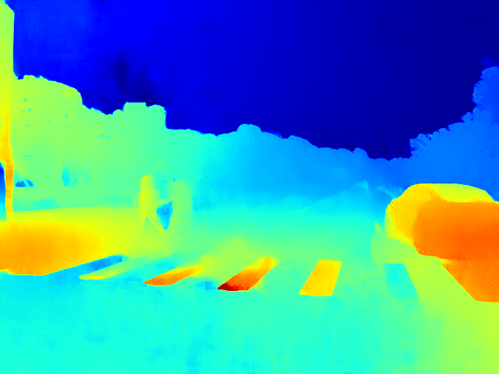

## Run RAFT-Stereo

[Download models](https://www.dropbox.com/s/ftveifyqcomiwaq/models.zip&dl=1) and place into `models/` folder (or use official doc method - you can find on [official page](https://github.com/princeton-vl/RAFT-Stereo)).

RAFT-Stereo is a Python-based codebase, so we will set up a dedicated environment for it. The GPU usage is assumed, and so `conda` will be used. I already have the latest CUDA SDK installed (version 12.4) and will use a matching Torch versions for it (the below commands were obtained from [pytorch.org](pytorch.org)):

```bash
conda create -n raftstereo124
conda activate raftstereo124
pip3 install torch torchvision torchaudio --index-url https://download.pytorch.org/whl/cu124
```

Now we can install the other requirements:
```bash
pip3 install matplotlib tensorboard scipy opencv-python tqdm opt_einsum imageio scikit-image
conda install p7zip
```

### Simple test

Run a test to verify the RAFT-Stereo codebase works within the established `conda` environment:

```bash
cd RAFT-Stereo
# If on Windows, we want to reverse the '\' to '/' in the full paths for left and right!
# make sure to use the correct full path for all the data and models:
python demo.py --restore_ckpt C:/Users/nordw/github/lab-stereo-depth/models/iraftstereo_rvc.pth --context_norm instance -l=C:/Users/nordw/github/lab-stereo-depth/test/left/*.png -r=C:/Users/nordw/github/lab-stereo-depth/test/right/*.png --output_directory C:/Users/nordw/github/lab-stereo-depth/test/output-raftstereo-rvc
```

### Optimized model and options

We can try a different model as well, for example, to optmize for speed. The faster model requires an additional build step; I had to move all the CUDA code to the parent directory as a few fixes were necessary for more recent CUDA SDK. Nothing to do here as it is all part of this repository now, just try to build and run:
```bash
# build optimization code, it will use CUDA based optimizations directly
# from repo directory:
pip3 install RAFT-Stereo-sampler/.
# run optimized model:
cd RAFT-Stereo
python demo.py --restore_ckpt C:/Users/nordw/github/lab-stereo-depth/models/raftstereo-realtime.pth --shared_backbone --n_downsample 3 --n_gru_layers 2 --slow_fast_gru --valid_iters 7 --corr_implementation reg_cuda --mixed_precision -l=C:/Users/nordw/github/lab-stereo-depth/test/left/*.png -r=C:/Users/nordw/github/lab-stereo-depth/test/right/*.png --output_directory C:/Users/nordw/github/lab-stereo-depth/test/output-raftstereo-realtime
```

The speedy version should perform (much) faster than the first test; in my case it was a difference of 8 second for the first model and 1 second for the improved one. My GPU is pretty old and basic, so the performance might be much better on more modern Hardware. 

### Convert for a whole batch

Now we are ready to run a whole batch conversion.

Robust model:
```bash
python demo.py --restore_ckpt C:/Users/nordw/github/lab-stereo-depth/models/iraftstereo_rvc.pth --context_norm instance -l=C:/Users/nordw/dataset/URBAN_F0/1_IMAGE/LEFT/*.png -r=C:/Users/nordw/dataset/URBAN_F0/1_IMAGE/RIGHT/*.png --output_directory C:/Users/nordw/dataset/URBAN_F0/output-RAFT-Stereo-robust/
```

Optimized model and options:

```bash
python demo.py --restore_ckpt C:/Users/nordw/github/lab-stereo-depth/models/raftstereo-realtime.pth --shared_backbone --n_downsample 3 --n_gru_layers 2 --slow_fast_gru --valid_iters 7 --corr_implementation reg_cuda --mixed_precision -l=C:/Users/nordw/dataset/URBAN_F0/1_IMAGE/LEFT/*.png -r=C:/Users/nordw/dataset/URBAN_F0/1_IMAGE/RIGHT/*.png --output_directory C:/Users/nordw/dataset/URBAN_F0/output-RAFT-Stereo-opt/
```

### Result overview

The presented generic model seems not to work well with Autonomous dataset, and a separate training stage might be required for better results. Example of malformed disparity (not how a "zebra" stripe stands out in its depth):

